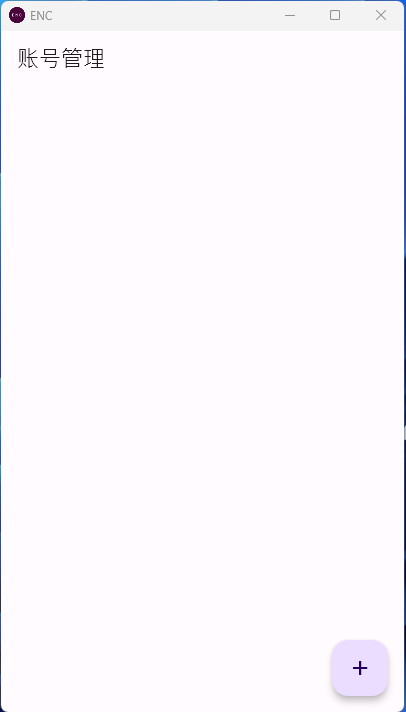

# 创建账号

## 初次创建账号

初次使用 ENC 时，会直接进入账号管理页面。

点击右下角的 + 按钮，应用会弹出新建账号的选项。

点击新建随机账号按钮后，一个随机的 ENC 账号就创建完毕了。

点击新创建的账号，即可进入账号主页。

## 创建其他账号

在账号主页点击左上角的用户头像，即可再次进入账号管理页面。

然后根据初次创建账号的步骤即可创建其他账号。

# 将账号复制到其他设备

在用户主页点击档案按钮，切换到用户档案页面。

点击用户档案页面中的“将账号复制到其他设备”按钮，进入账号复制页面。

然后在需要复制此账号的设备中打开 ENC 的账号管理页面，打开新建账号选项，选择从其他设备导入账号。

此时用户应该会在两端看见相同的界面。

然后任意一端选择生成连接码，另一端选择输入连接码。

生成链接码的一端会生成一个二维码，供输入连接码的一端扫描，如果对方设备没有扫描二维码的能力，可切换至校验码，并在另一端手动输入 URL 及校验码。

之后跟随应用引导进行确认并再次输入加密校验码后，ENC 便会开始交换账号数据，并在完成后弹出提示。
