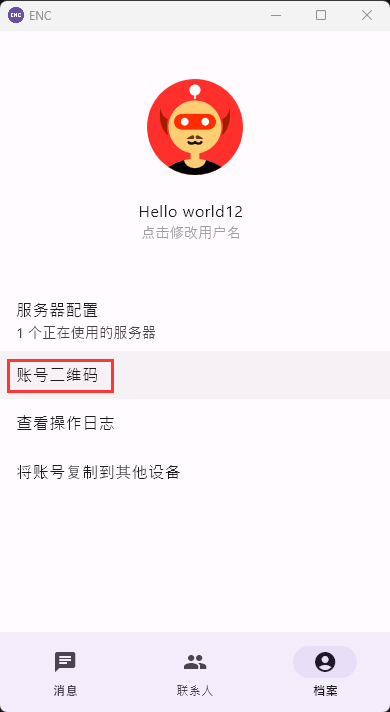
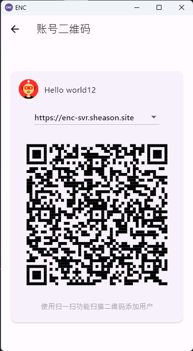
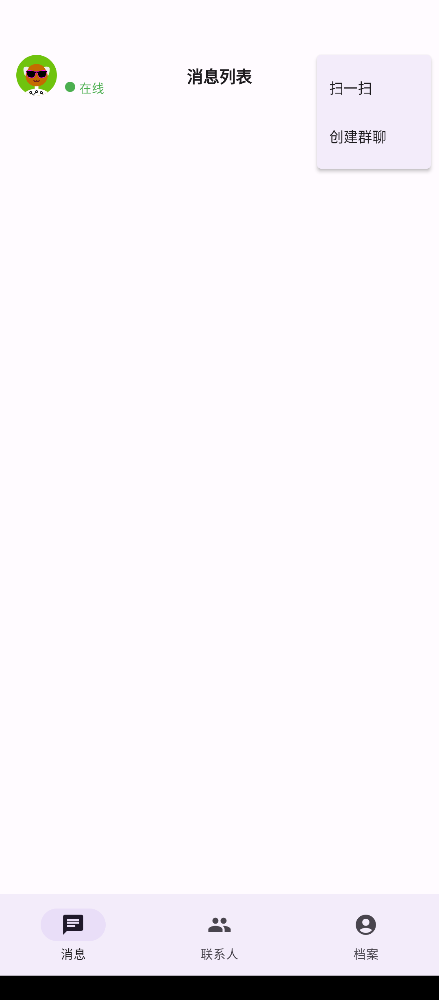
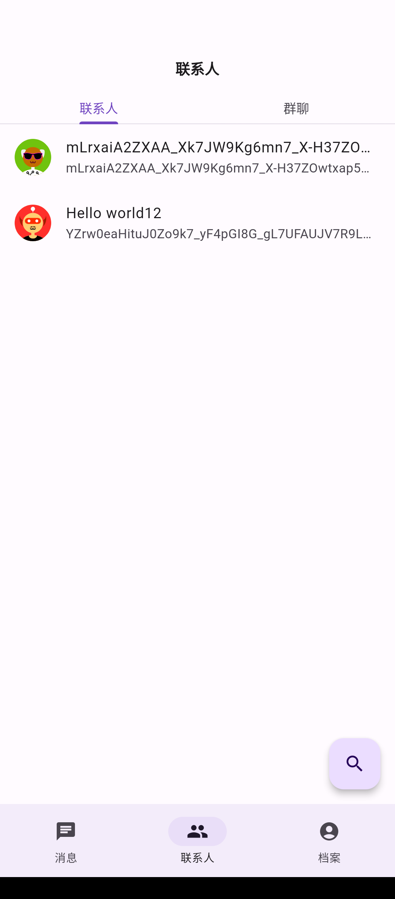
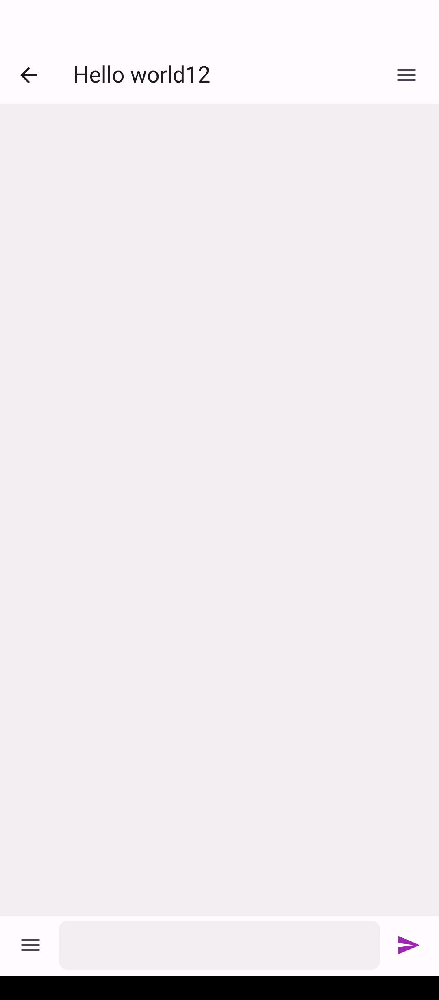
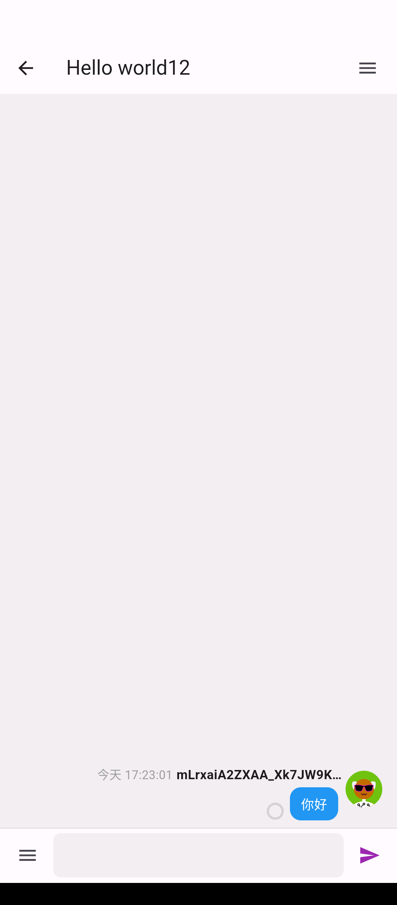
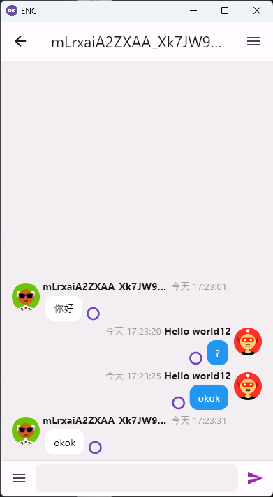
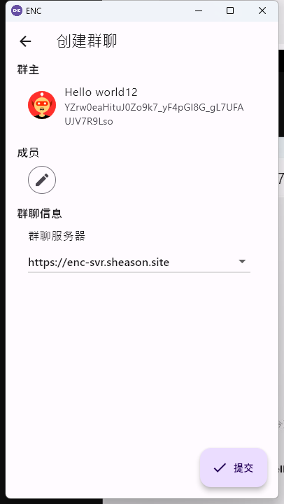
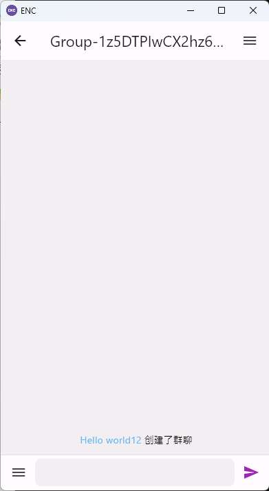

# 发起会话

## 发起私聊会话

在 ENC 中，发起私聊会话首先需要获取对方的用户信息。

目前 ENC 用户可以通过 “档案” 页面下的 “账号二维码” 按钮向其他用户分享当前帐号的信息。

用户点击此按钮后会进入一个二维码展示页面，页面中央会展示一个二维码：

移动端用户可通过扫描二维码的方式获取该用户的信息：

由于桌面客户端无法使用扫描二维码的功能，在桌面端获取用户信息需要在联系人页面中点击右下角的搜索按钮进入联系人搜索页面，并输入对方账号的 URL（账号 URL 可在账号二维码页面通过点击二维码复制到剪切板）：

在扫描二维码或是手动输入对方的账号 URL 后，ENC 会展示对方的基本信息：

点击其中的“发起会话”按钮，ENC 会跳转到私聊会话页面：

在下方的输入框编辑一条信息，点击右侧按钮进行发送，即可在会话窗口看到自己发送的信息：

下面是接收端私聊窗口：

## 发起群聊会话

在消息列表页面中，点击右上角的“＋”号，然后点击“创建群聊”按钮，即可进入创建群聊的表单页面。

群聊成员可以通过成员一栏的铅笔按钮进行编辑。

同时群聊必须指定一个托管服务器，这是因为 ENC 的群聊本质上是一个中心化服务，因此必须要由群聊创建者来指定一个服务器以处理群聊的中的鉴权、成员变更、群聊名称变更等问题。

点击右下角的提交按钮后，ENC 会向指定服务器发起请求，如果服务器成功创建群聊，则 ENC 将会跳转到群聊页面：

