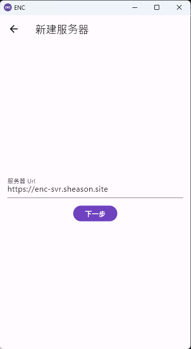
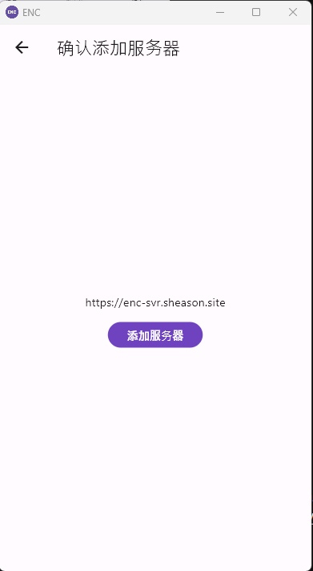
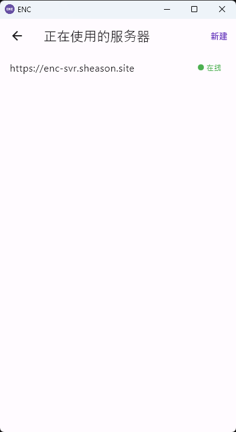

# 连接至服务器

在用户档案页面，点击服务器配置按钮即可配置当前账号的服务器信息。

点击后应用会跳转到如下页面。

点击右上角的新建按钮，会弹出输入服务器 URL 的表单。

这里以 ENC 的公共测试服务器 **https://enc-svr.sheason.site** 为例，当用户点击新建按钮进入“新建服务器”页面后，在表单项“服务器 Url”中填入 **https://enc-svr.sheason.site** 。

然后点击“下一步”按钮，ENC 会确认用户填入的服务器是否可用，如果可用，则会展示“确认添加服务器”页面：

用户在确认添加服务器页面确认添加的服务器信息无误以后，即可通过点击“添加服务器”按钮，将此服务器添加到该账号的服务器列表。

在成功添加服务器以后，ENC 服务器会为当前账号创建一个 URL，供其他用户访问，同时为当前帐号提供静态资源托管、离线消息托管、多设备数据同步等功能。

当用户至少连接到一个服务器以后，即可通过 [发起会话](/manual/发起会话) 功能向其他用户发送信息。
